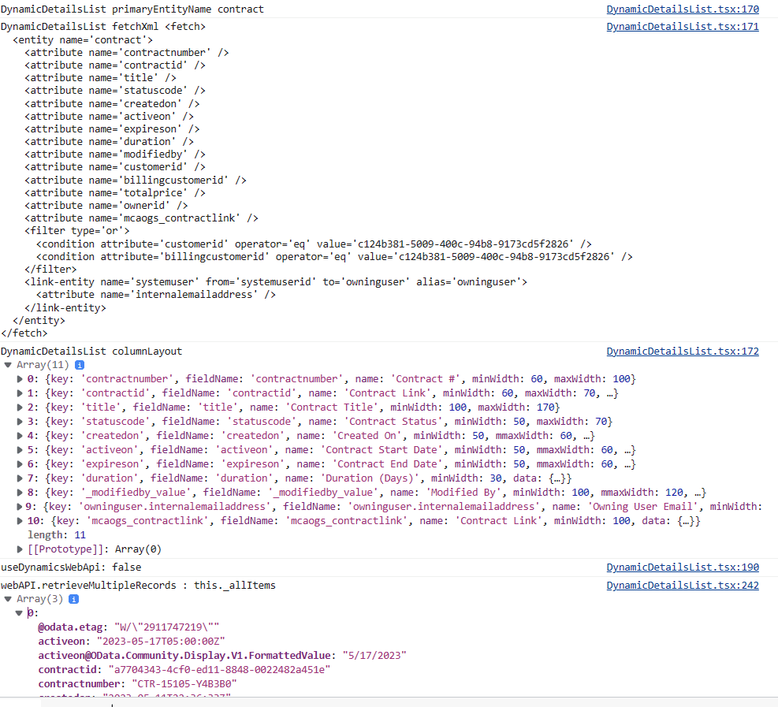

# [FetchXml DetailsList](https://github.com/donschia/FetchXmlDetailsList)
## Description
This PCF Control generates a FluentUI DetailsList for subgrids loaded via a custom FetchXml query and column layout. This extends the query capabilities beyond the standard Model-Driven App subgrid.  You need to include an ID Placeholder which is replaced at runtime with the current record id.  It is also possible to pass in an id from the current record to be replaced in the same fashion.

---


This solution was created to meet some recent challenges.  Specifically I have fairly complex data model that varies based on some data points.  I am able to create multiple subgrids and switch between via simple form JavaScript.  Another challange was when Microsoft removed the Contract entity making it longer possible to view in the modern UI.  So until we are able to migrate all of the data (and the super complex data models) to a new entity, we need to be able to navigate to Contract records.  This solution allow us to render links to Contracts using the classic web interface.

I had searched in vain for a similar FetchXml driven subgrid control so this seemed like a good enough reason to roll up the sleeves and try my hand at a PCF control.  It's far from perfect and uses some hacks, but it does solve some real issues fopr us in the meantime.

## Features
- Dynamic queries can be more complex than model driven apps views allow, for example with many more linked entities.  You can even include links to entities that are no longer available in the new user interface (i.e. Contract).
- Uses [FluentUI DetailsList]( https://developer.microsoft.com/en-us/fluentui#/controls/web/detailslist) with a familiar look and feel - similar to model-driven read-only subgrid, supporting basic sorting and resizing of columns.  
- Double clicking a row navigates to the base record and supports navigation to linked entities.
- Customization options for each column include date formatting, toggleable entity linking, absolute urls, relative urls, and so on.
- Debug mode shows all data returned from FetchXml query for building the column layout.
- Uses Placeholder to filter by a record id.  This defaults to the current record.  But this can be overridden with another lookup on the current form.
- Quick rendering, even for larger datasets.  
***

## Quick Start using Pre-Built Solution
A [Managed or Unmanaged Solution](https://github.com/donschia/FetchXmlDetailsList/tree/master/solution/bin/Release) is available to download and install in your development environment.  

1. After installing, you add the control to your form via the legacy or modern designer (I use legacy due to field length issue described later).  Simply add any text field and bind this control to it. 


2. Be sure to hide the label. 


3. Go to the Controls tab and pick the `FetchXml DetailsList`.

4. Set the radio buttons so the control is visiable, and set the Input Parameters.


### Set Up Notes
Both the new and legacy designers will likely not allow you to paste in text long enough for more elaborate FetchXml queries and Column Layouts, so you have to use the legacy designer and a [workaround to extend the field length](https://powerusers.microsoft.com/t5/Power-Apps-Pro-Dev-ISV/Problem-with-maximum-length-of-Input-parameters-which-are-of/td-p/288295).  
Essentially you use the legacy designer and hack the input box via F11 dev tools to set the maxlength to something like 9999 instead of the default 2000 if your text doesn't fit.
***
## Input Parameters (Properties)
The grid has input parameters which must be set.

- <code>FetchXml</code> is the full FetchXml with a placeholder for the Record Id in place.
```xml
<fetch>
  <entity name='contract'>
    <attribute name='contractnumber' />
    <attribute name='contractid' />
    <attribute name='title' />
    <attribute name='statuscode' />
    <attribute name='createdon' />
    <attribute name='activeon' />
    <attribute name='expireson' />
    <attribute name='duration' />
    <attribute name='modifiedby' />
    <attribute name='customerid' />
    <attribute name='billingcustomerid' />
    <attribute name='totalprice' />
    <attribute name='ownerid' />
    <attribute name='mcaogs_contractlink' />
    <filter type='or'>
      <condition attribute='customerid' operator='eq' value='[RECORDID]' />
      <condition attribute='billingcustomerid' operator='eq' value='[RECORDID]' />
    </filter>
    <link-entity name='systemuser' from='systemuserid' to='owninguser' alias='owninguser'>
      <attribute name='internalemailaddress' />
    </link-entity>
  </entity>
</fetch>
```

- <code>RecordIdPlaceholder</code> is the placeholder text. This will be replaced with the current record id.  
i.e. <code>[RECORDID]</code>

- The <code>Record Id</code> is read from the current record in a bit of a hack at the moment as it's not super easy to get this in the Power Apps framework.  This can also be overridden with another lookup on the current form.  Simply set the <code>OverriddenRecordIdFieldName</code> to a lookup field on the current form and this id will be used instead of the id of the current record.

- <code>ColumnLayoutJson</code> is a collection of columns used for the table layout.  See details below.
- <code>ItemsPerPage</code> is defaults to 5000 as paging is currently not implemented.  // [NOT SUPPORTED CURRENTLY] ItemsPerPage is how many items to show per page. For now this is set at 5000 since paging and sorting seem to be at odds with eachother.
- <code>DebugMode</code> can be set to <code>On</code> or <code>Off</code>.  When enabled, this will write extra details to console, break when entering the main control, and break on handled exceptions.


## ColumnLayoutJson
This is a list of [IColumn](https://learn.microsoft.com/en-us/javascript/api/sp-listview-extensibility/icolumn?view=sp-typescript-latest) from the [FluentUI DetailsList]( https://developer.microsoft.com/en-us/fluentui#/controls/web/detailslist).  Simply include all of the required fields for each column your data grid.  The options <code>data</code> object can be helpful for extra customization.


| Field Name | Required | Type | Description |
| --- | --- | -- | -- |
| key | Yes | String |  Unique key for data item |
| fieldName | Yes |  String |  Column Label |
| name | Yes |  String |  Field name matched from the returned Xrm Data |
| minWidth | Yes |  Number |  Minimum field width (ie. 50) |
| data | No | Object| Data Object with special stuff.  See defination below. |

### data Object
| Field Name | Required | Type | Description |
| --- | --- | -- | -- |
|dateFormat | No | String | You can force a date into a particular format by specifying this.  This uses [date-fns format strings](https://date-fns.org/v2.29.3/docs/format) i.e. <code>yyyy-MM-dd</code> |
|entityLinking | No | Boolean | Set to <code>False</code> to prevent navigation to linked entities. Otherwise links are enabled. |
|url | No | String | Absolute URL.  Or can be relative from the <code>[BASE_ENVIRONMENT_URL]</code> path.  You can include the current record id by using the <code>[ID]</code> placeholder.|

ColumnLayoutJson Example:
```json
[
  {
    "key": "contractnumber",
    "fieldName": "contractnumber",
    "name": "Contract #",
    "minWidth": 60,
    "maxWidth": 100
  },
  {
    "key": "contractid",
    "fieldName": "contractid",
    "name": "Contract Link",
    "minWidth": 60,
    "maxWidth": 70,
    "data": {
      "url": "[BASE_ENVIRONMENT_URL]/main.aspx?etc=1010&pagetype=entityrecord&id=[ID]",
      "urlLinkText": "Contract Link"
    }
  },
  {
    "key": "title",
    "fieldName": "title",
    "name": "Contract Title",
    "minWidth": 100,
    "maxWidth": 170
  },
  {
    "key": "statuscode",
    "fieldName": "statuscode",
    "name": "Contract Status",
    "minWidth": 50,
    "maxWidth": 70
  },
  {
    "key": "createdon",
    "fieldName": "createdon",
    "name": "Created On",
    "minWidth": 50,
    "mmaxWidth": 60,
    "data": {
      "dateFormat": "yyyy-MM-dd"
    }
  },
  {
    "key": "activeon",
    "fieldName": "activeon",
    "name": "Contract Start Date",
    "minWidth": 50,
    "mmaxWidth": 60,
    "data": {
      "dateFormat": "yyyy-MM-dd"
    }
  },
  {
    "key": "expireson",
    "fieldName": "expireson",
    "name": "Contract End Date",
    "minWidth": 50,
    "mmaxWidth": 60,
    "data": {
      "dateFormat": "yyyy-MM-dd"
    }
  },
  {
    "key": "duration",
    "fieldName": "duration",
    "name": "Duration (Days)",
    "minWidth": 30,
    "data": {
      "type": "number"
    }
  },
  {
    "key": "_modifiedby_value",
    "fieldName": "_modifiedby_value",
    "name": "Modified By",
    "minWidth": 100,
    "mmaxWidth": 120,
    "data": {
      "entityLinking": true
    }
  },
  {
    "key": "owninguser.internalemailaddress",
    "fieldName": "owninguser.internalemailaddress",
    "name": "Owning User Email",
    "minWidth": 100,
    "mmaxWidth": 120
  },
  {
    "key": "mcaogs_contractlink",
    "fieldName": "mcaogs_contractlink",
    "name": "Contract Link",
    "minWidth": 100,
    "data": {
      "url": "[USE_VALUE]",
      "urlLinkText": "[USE_VALUE]"
    }
  }
]
````
## ColumnLayoutJson Tips
If you have DebugMode turned on you can see in the console log three important items: `DynamicDetailsList fetchXml` (with the RecordIdPlaceholder replaced), `DynamicDetailsList columnLayout `, and `webAPI.retrieveMultipleRecords : this._allItems` which shows the records returned.


***

# Initial Setup to Build

1. Ensure you have [Node.js](https://nodejs.org/en/) installed, 

2. Clone this repository.

3. Navigate into the project directory in terminal.
   ```bash
   $ cd FetchXmlDetailsList
   ```
4. Install the dependencies
   ```bash
   $ npm install
   ```
5. Demo the subgrid with sample data and column layout in PCF Test Harness. Linking is disabled since this is not allowed in the tester.
   ```bash
   $ npm start  
   ```

## Build and Deploy
You can build and deploy to your currently configured DEVELOPMENT Environment using the CLI [PAC PCF PUSH](https://learn.microsoft.com/en-us/power-platform/developer/cli/reference/pcf#pac-pcf-push) by running:  <code>buildAndDeploy.ps1</code>.  Note that the CLI requires connecting to your development org first. See the documentation for more details.
You will need to ensure you have installed the [Microsoft PowerApps CLI](https://learn.microsoft.com/en-us/power-platform/developer/cli/introduction#install-power-apps-cli). 
   - <code>buildAndDeploy.ps1</code> will build the component, add it to a temporary solution (PowerAppsTools_YourOrg) , import to your DEV environment and Publish All.
Prerequitiste is to make sure you can connect to your DEV environment using the CLI tools.
```bash
$ buildAndDeploy.ps1
```
# Notes
## Response Details
The response to the FetchXml get multiple query should have details in it which we need for the rendering to work.  Essentially the Xrm Web Api sets the headers and returns details we can work with.
`prefer: odata.include-annotations="*"`  Enable DebugMode and check the F11 console log.  This will give you a good idea how to include columns for the ColumnLayoutJson.

# Issues
## Dynamics-Web-Api library initial set up issue
For ease of use, this control can be switched to use the dynamics-web-api library.  You can reference the field name with the _Formatted suffix.  But the default is to just use the out of the box xrm web api.

There seems to be an issue with the dynamics-web-api 3rd party library. This gives a strange crypto error. You can either use the out of the box Web Api, or you can fix it by hacking the webpackConfig.js for pcf-scripts to tell it to ignore it.

../FetchXmlDetailsList/blob/master/node_modules/pcf-scripts/webpackConfig.js#L61

Change this:
```javascript
resolve: {
        // Tell webpack which extensions to try when it is looking for a file.
        extensions: ['.ts', '.tsx', '.js', '.jsx'],
},
```

to this:
```javascript
resolve: {
        // Tell webpack which extensions to try when it is looking for a file.
        extensions: ['.ts', '.tsx', '.js', '.jsx'],
       fallback: { "crypto": false },
},
```

---

## Errors
If you get runtime errors you may need to use a _Formatted field. For example, here it seems to be having a hard time with the date. <code>
Objects are not valid as a React child (found: Wed Dec 31 9000 00:00:00 GMT-0600 (Central Standard Time)). If you meant to render a collection of children, use an array instead.</code>
Another option if it's a date issue is to be sure to use a dateFormat in the column layout data object.

***

## TODOs:
- Improve documentation.
 
- Paging!  Paging is not implemented yet. Page size is locked at 5000 for now.

- Perhaps allow styling via input parameter.  i.e. alternate row color endable/disable, etc.

- When not using the Dynamics-Web-Api 3rd party libary, don't include (require) it.  This will make the final bundle.js smaller.
    
- Export is very rudimentary.  It would be much better if the header was the actual column name instead of column fieldName.

- If you have fewer fields, the column widths are not right.  But with enough fields, it seems to space them out fine.

- Test harness layout has issues, overlaying the whole test page and issues with control width.  But seems to work when rendered on the form.
  